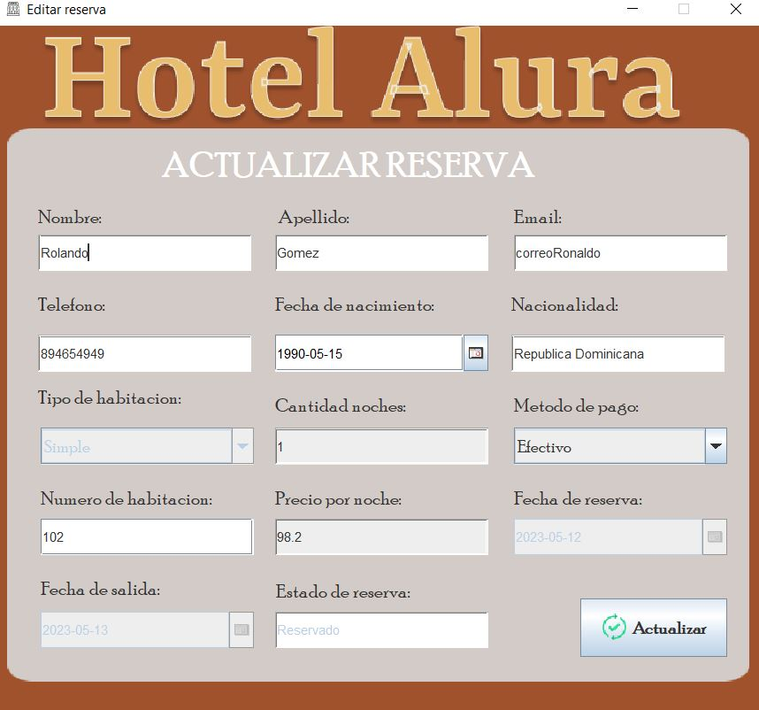

# Challenge ONE | Java | Back-end | Hotel Alura

# Descripcion del proyecto

El hotel Alura's software, esta diseñado con una interfaz amigable con el usuario en donde se podra tener el control de las actividades del hotel tales como:

<ul>

   <li> Registro usuario </li>
   <li> Busqueda de disponibilidad </li>
   <li> Creacion de reservas </li>
   <li> Edicion </li>
   <li> Eliminacion </li>
   <li> Historial de reservas </li>

</ul>

#  Tecnologias

<ul>

   <li> Java </li>
   <li> Eclipse IDE </li>
   <li> Biblioteca JCalendar </li>
   <li> MySql </li>
   <li> Plugin WindowBuilder </li>
   <li> Biblioteca C3PO para crear Pool de conexiones </li>

</ul>

#  Detalle del software
  
<ul>

   <li> Patron de diseño MVC </li>
   <li> MySql </li>
   <li> Conexion a base de datos (patron de diseño DAO) </li>
    <ul>
      <li> CRUD </li> 
      <li> Consulta con queries anidados </li> 
      <li> INNER JOIN </li>
    </ul>
   <li> Biblioteca JCalendar </li>   
   <li> Plugin WindowBuilder </li>
   <li> Biblioteca C3PO para crear Pool de conexiones </li>

</ul>

# Pantallas del software

<ul>
  
   <li> Pantalla principal </li>
   <li> Login </li>
   <li> Manu principal </li>
   <li> Formulario de registro de reservas </li>
   <li> Historial de reservas </li>   
   <li> Formulario de actualizacion de reservas </li>

</ul>

# Imagenes del software

 

 

 

 

 

 

